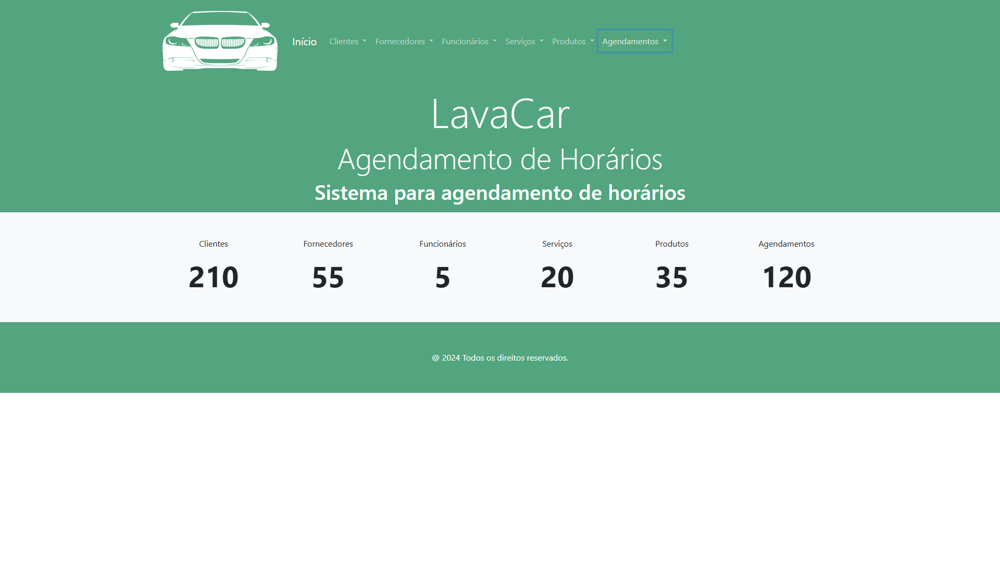

# Trabalho de desenvolvimento web QUALQUER COISA

OLA MUNDOeervrevrevrttrvrt

## Como Usar

1. **Crie e ative o [ambiente virtual](https://docs.python.org/pt-br/3/library/venv.html)**

Linux/Wsl
```bash
python3 -m venv .venv
source .venv/bin/activate
````
Windows
```bash
python -m venv .venv
.\.venv\Scripts\Activate
```

2. **Instale as dependências**
```bash
pip install -r requeriments.txt
```

3. **Migrations e Runserver**
```bash
python manage.py makemigrations
python manage.py migrate
python manage.py runserver
```
comentario
___

